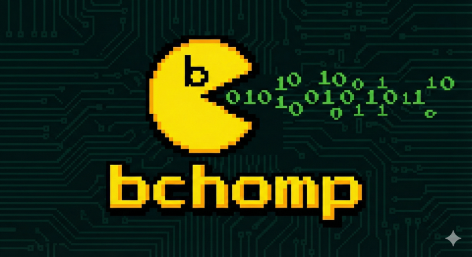

# bchomp



## Project Overview

`bchomp` is a lightweight parser-combinator library for declarative binary parsing in Python. Its primary goal is to make it easy to build small, composable parsers that are readable and testable for large binary formats. The library emphasizes:

- composability of primitive parsers into higher-level grammars,
- relocatability so parsers can be reused without global seeks,
- lazy parsing so expensive payloads are only decoded when needed,
- streaming parsers that can emit intermediate results without blocking.

The SQLite file parser at `examples/sqlite.py` is included as an example that demonstrates how to apply `bchomp` to a real-world binary format. The example is valuable as a usage demonstration, but the library itself is intended to be format-agnostic and reusable for any binary format.

### Key Features & Concepts

- **Parser-Combinator Library (`bchomp/parser.py`):** Core of the project — a small, functional toolkit of primitives and combinators (e.g., `sequence`, `many`, `map_p`, `satisfy`) and helpers for working with stream positions (`seek`, `position`). There is also support for streaming parsers (`StreamingParser`/`emit`) that can produce values incrementally while parsing. 
- **Lazy Evaluation:** Built-in `lazy`/deferred parsers allow expensive decoding to be postponed until the value is actually needed, enabling fast initial scans of large files.
     Note: laziness is implemented by automatically creating lazily-wrapped classes via `make_lazy` that preserve the protocol-based interface. This decouples deferred evaluation from the public API so callers normally don't need to access `.value` directly — evaluation is interface-preserving and happens transparently.
- **Relocatable Parsers:** Support for `with_relocation` and the `@relocatable` decorator makes parsers composable without relying on global file offsets.
- **cstruct compatibility:** An adapter bridges `cstruct`/`dissect.cstruct` readers into `bchomp` parsers so existing zero-copy cstruct readers can be reused (`bchomp/adapters/cstruct.py`).

## Analysis

### Pros
- **Educational:** An excellent tool for learning about parser design, functional programming concepts, and the internals of the SQLite file format.
- **Declarative & Readable:** The grammar is easy to read and maintain because the code structure directly maps to the data structure being parsed. It communicates the *process* of parsing, not just the *layout* of the data.
- **Efficient Lazy Loading:** Avoids parsing data until it is needed, which is a sophisticated and efficient approach for handling large data files.
 - **Streaming advantages:** Streaming parsers can lower peak memory consumption and reduce latency by emitting intermediate results incrementally rather than requiring full decoding up-front.

### Cons
- **Performance:** As a pure Python implementation running on CPython, it will be significantly slower than production-grade parsers written in systems languages like C or Rust. This is expected for a project of this nature.
- **Error Reporting:** Error messages are currently basic. A production-ready parser would require more sophisticated error reporting to provide better context on failures.
- **Do-notation typing:** The `@do` generator-based notation is ergonomically nice but it loses precise return-type information for static type checkers; the wrapper around generator functions prevents some tools from inferring the parser result type, so you may need to add explicit casts or annotations when strong typing is required.

   Correct form (static-checker friendly):

   ```py
       lazy_content_stream: p.ParserState = yield p.take(size, p.get_state())
       # now `lazy_content_stream` is known to be `p.ParserState` to the type checker
   ```

## Roadmap
- **Backtracking research (needed):** Investigate backtracking strategies and how to support safe, efficient backtracking with streaming parsers — e.g. state snapshots vs. checkpointing, interplay with `Suspend`/resume and trampolines, and typing/performance trade-offs. It might also be that backtracking is less pervasive in binary parsing since it typically relies on Tag-Length-Value encoding schemes.`


## Quickstart

First, ensure you have Python 3.14+ installed.

1.  **Set up a virtual environment (optional but recommended):**
    ```bash
    python3 -m venv .venv
    source .venv/bin/activate
    ```

2.  **Run the parser:**
    The main entrypoint is located at `examples/main.py` and reads the example database at `examples/data/chinook.db`. Run it as a module so imports resolve correctly:
    ```bash
    python3 -m examples.main
    ```

## Files of Interest

- `bchomp/parser.py`: The core parser-combinator library.
- `examples/sqlite.py` and `examples/main.py`: The SQLite grammar example that uses `bchomp`.
- `bchomp/adapters/cstruct.py`: Adapter that converts cstruct readers into `bchomp` parsers (`from_cstruct`).